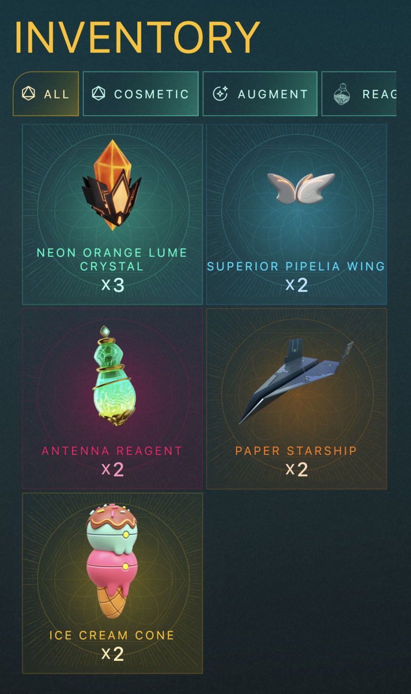

# Flutter Assessment



This repo contains a simple mobile app with the backend powered by [Pocketbase](https://pocketbase.io) and the front-end in Flutter.

## Getting Started

You need to have docker and flutter 3.3.0 installed on your machine to run this.

To start the backend:

```
docker-compose up -d
```

The admin username is `hello@genopets.me` and the password is `flutter-assessment`.

The security rules have been set to be fully public. There is no authentication needed to CRUD anything in the database.

Then you may run the Flutter app in an emulator as usual, you should be able to see the above screen.
